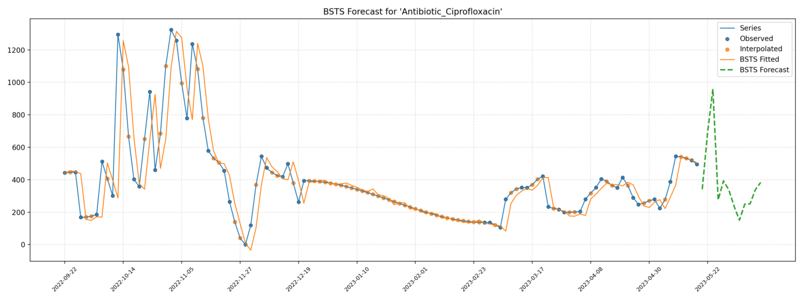
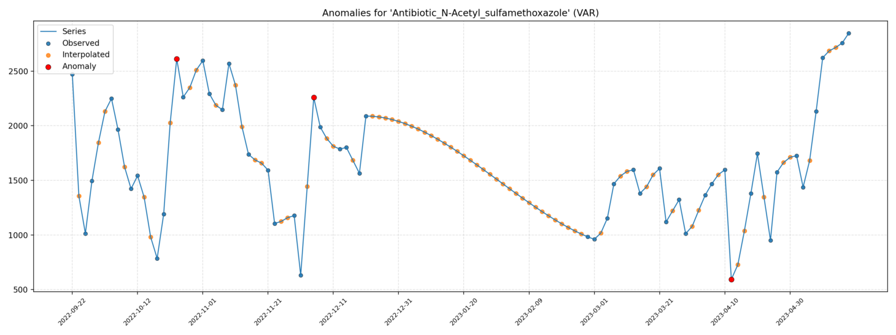

# TS Anomaly Tool

Streamlit app for time series forecasting and anomaly detection from one or more CSV files.

<p align="center">
  
  
</p>

Upload one or more CSV files with:
- `Date` column (parseable datetime)
- one or more numeric columns (example: `Drugs`)

The app runs forecasting + anomaly detection and produces:
- `summary.csv`
- `anomalies.txt`
- plots (PNGs)
- downloadable `outputs.zip`

## Local run

```bash
python -m venv .venv
source .venv/bin/activate
pip install -U pip
pip install -e ".[app]"
streamlit run streamlit_app.py
```
